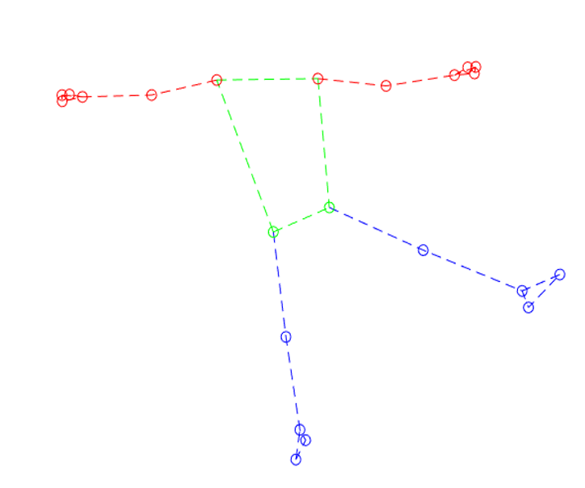

# A real-time computer vision gait analysis system for robotic rehabilitation therapies

<p align="center">
  
  Welcome to the GitHub repository for a gait analysis program using MediaPipe Pose!
</p>


## Introduction


This GitHub repository has two folders corresponding to two ROS packages and one folder `<documentation>` containin the final thesis. One for the interfaces `d2w_interfaces`, which contains the custom message that the main program will use to send the landmark coordinates estimated by MediaPipe Pose; and the `pose_estimation`, which contains the main program that works as a publisher node.

The main program has been developed using Python 3.8.2.

## Installation


This project has been developed for a Windows device and runs within a ROS environment. Therefore, ROS2 Foxy needs to be previously installed.

The first step of the installation process is to install ROS2 Foxy. The official documentation to install ROS2 Foxy from binaries in Windows can be found in the following link. 

[Windows (binary) — ROS 2 Documentation: Foxy  documentation](https://docs.ros.org/en/foxy/Installation/Windows-Install-Binary.html)

Once ROS2 Foxy is installed, a workspace has to be created to contain the package for the project and its interfaces. Following the steps provided by ROS2 Foxy Documentation Tutorials:

[Creating a workspace — ROS 2 Documentation: Foxy  documentation](https://docs.ros.org/en/foxy/Tutorials/Beginner-Client-Libraries/Creating-A-Workspace/Creating-A-Workspace.html?highlight=workspace)

In a `x64 Native Tools Command Prompt for VS 2019`, execute the following command to source ROS2. The path where the local_setup.bat file is may vary if the ROS installation was performed from source or binaries. 

```
call C:\dev\ros2_foxy\local_setup.bat
```

Following the Official Documentation tutorial, the workspace directory `<pose_ws>` will be created in the `<C:\dev>` directory

```
md C:\dev\pose_ws\src
cd C:\dev\pose_ws
```

Packages will be stored inside the src folder of the `<pose_ws>` directory. Then, run the following command to clone the GitHub repository

```
git clone https://github.com/martaglezgarcia/mediapipe-gait-analysis src 
```

In the root of the workspace, run colcon build.

```
colcon build
```

This command should have created `<build>`, `<install>` and `<log>` folders in your workspace root directory. This should be your module diagram:

```
<pose_ws>
|__ <build>
|__ <install>
|__ <log>
|__ <src>
    |__ <documentation>
    |__ <d2w_interfaces>
    |__ <pose_estimation>
    |__ README.md
    |__ requirements.txt
```

### Python dependencies

The project was developed using Python 3.8.2 and the necessary dependencies can be installed from the \textit{requirements.txt} file. 

```
pip install -r C:\dev\pose_ws\src\requirements.txt
```

## User guide


The first step is to modify the `settings.yaml` file according to the user’s system:

```
---
 camera0: 1 
 camera1: 2
 frame_width: 1920
 frame_height: 1080
 view_resize: 2
 mono_cal_frames: 40
 stereo_cal_frames: 40
 cooldown: 100
 square_size: 36 # square board size in mm
 board_rows: 10
 board_cols: 7
```

- `camera0` and `camera1` - device ids
- `frame_width` and `frame_height` - frame size
- `view_resize` - frame resize factor
- `mono_cal_frames` and `stereo_cal_frames` - number of pictures that will be taken to perform the calibration of each camera individually and both of them at the same time, respectively
- `cooldown`- countdown between the pictures taken
- `square_size` - size of the checkerboard squares in mm
- `board_rows` and `board_cols` - number of crosses in the checkerboard (i.e. for a 8x8 checkerboard we would write 7 rows and 7 columns)

Once the modification of the files in the packages have been done, open a terminal and run the following commands to execute the program.

1. Source ROS2 Installation

```
call C:\dev\ros2_foxy\local_setup.bat
```

2. Access workspace

```
cd C:\dev\pose_ws
```

3. Build existing packages

```
colcon build
```

```
call install/setup.bat
```

4. Run the publisher node

```
ros2 run pose_estimation talker
```

The terminal where the program is running will display a menu with different modes:

```
Select the program mode:

 ___________ CALIBRATION ___________
 1. Calibration

 ___________ MEDIAPIPE POSE ANALYSIS ___________
 2. MPP Video Analysis 2D
 3. MPP Video Analysis 3D
 4. MPP Real-time Analysis 2D
 5. MPP Real-time Analysis 3D

 ___________ GAIT ANALYSIS ___________
 6. Kinematic Analysis
	 1. Video Kinematic Analysis 2D
	 2. Real-time Kinematic Analysis 2D

 0. Exit

 Your selection:
```

### Calibration

If the user wants to perform any 3D analysis, a calibration of the system needs to be performed in the first place. This process requires the use of a checkerboard pattern of a known size. Firstly, the cameras will be calibrated individually in order to estimate the intrinsic parameters of each camera. Once this process is performed once, the parameters of these cameras can be reused provided that the cameras do not change.

The program will open a new window with the video stream captured by the camera. The user needs to press the `SPACEBAR` key and the program will start taking the number of pictures defined in the `mono_cal_frames` variable of the `settings.yaml` file. These pictures will be stored in a folder called `<mono_frames>`. The program will display a reprojection error (RMSE) for the estimated intrinsic parameters. This value should be at least lower than 0.5. The resulting parameters will be stored in a .dat file in the `<camera_parameters>` folder. Note that the lowest this error, the better the calibration, and the better the estimation.

This process will be repeated for the other camera.

The stereo-calibration process follows the same procedure to estimate the extrinsic parameters. However, the program will display the video stream of both cameras at the same time and two pictures will be taken simultaneously and stored in the `<stereo_frames>` directory. In contrast with the extraction of the intrinsic parameters, the stereo-calibration of the system needs to be performed every time the cameras are moved.

<p align="center">
  
</p>

For more information about this process, the user can consult the project memory found in the `<documentation>` folder.

This module diagram shows the folders that running this program will create in the workspace directory:

```
< pose_ws >
|_ < build >
|_ < install >
|_ < log >
|
|_ < angular_data >
|   # stores .xlsx files with temporal angular data for hip, knee, & ankle
|_ < camera_parameters >
|   # stores .dat files with camera0 & camera1 both intrinsics & extrinsics
|_ < mono_frames >
|   # stores the images taken when performing the individual camera calibration
|_ < pose_results >
|   # stores .mat files with pose coordinates and .mp4 videos with pose solutions
|_ < src >
|   |_ < pose_estimation >
|   |   |_ < pose_estimation>
|   |       |_ settings.yaml
|   |       |   # settings that the user needs to adjust based on its system
|   |       |_ publisher_member_function.py
|   |           # main script
|   |_ < d2w_interfaces >
|       |_ < msg>
|           |_ SkeletonPoints.msg
|               # custom ROS message
|
|_ < stereo_frames>
|   # stores the images taken when performing the stereo-calibration
|_ < video_results>
    # stores the raw videos recorded by the cameras
```

## Credits and contact

This project was developed for the Biomedical Engineering degree Final Bachelor’s Thesis of Marta González García at Universidad Carlos III de Madrid (UC3M) in collaboration with CSIC.

  - :email: <a href="glezgarmarta@gmail.com">glezgarmarta@gmail.com</a>
