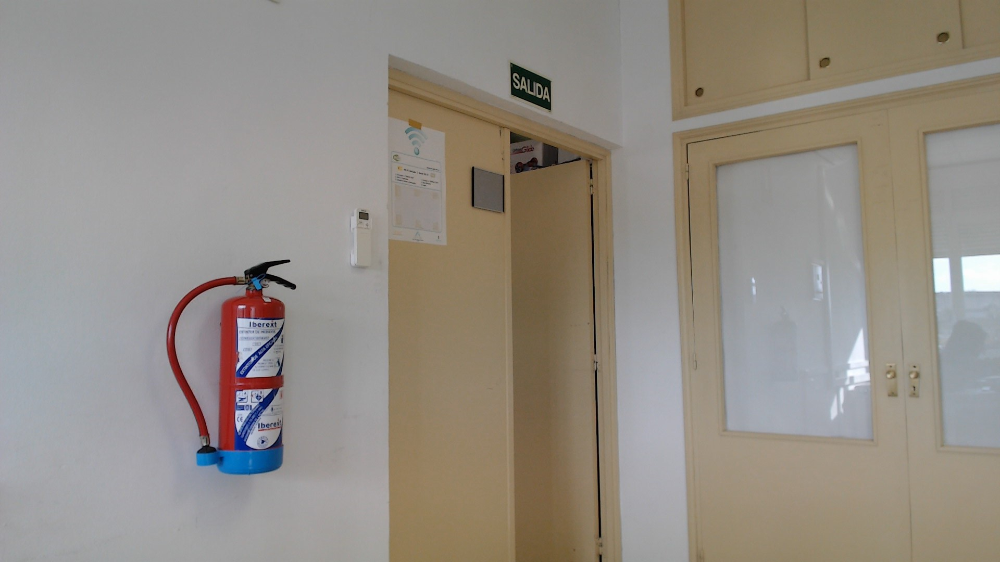
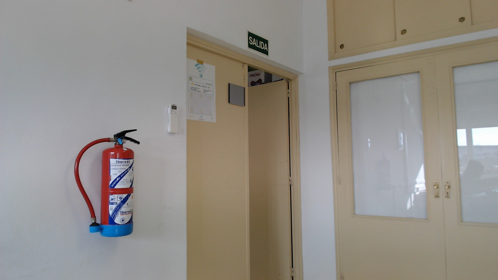
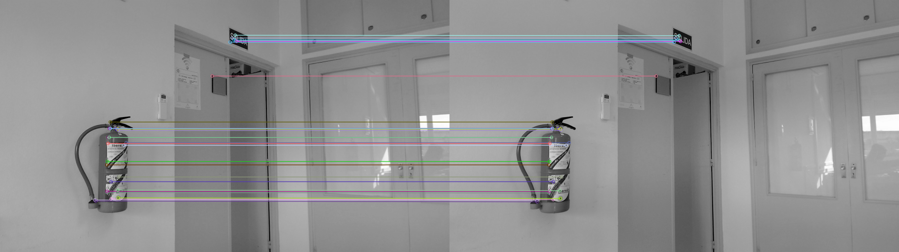
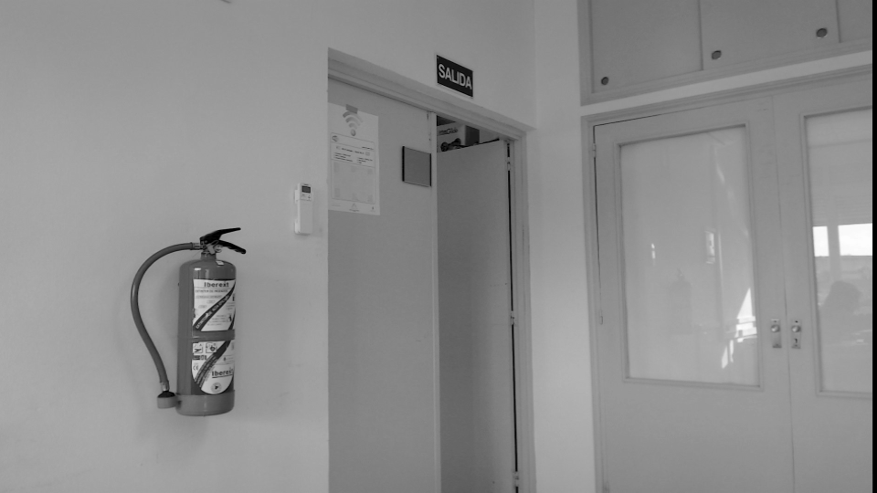
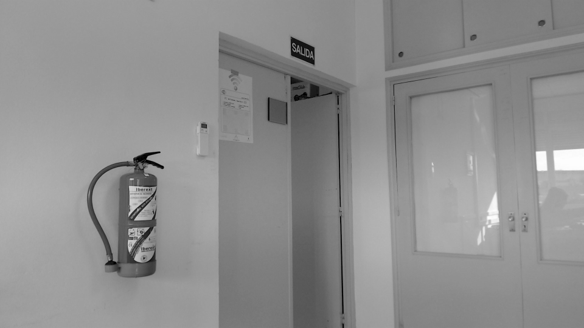
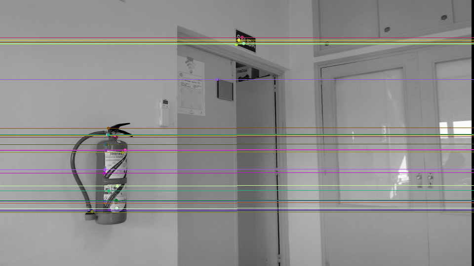
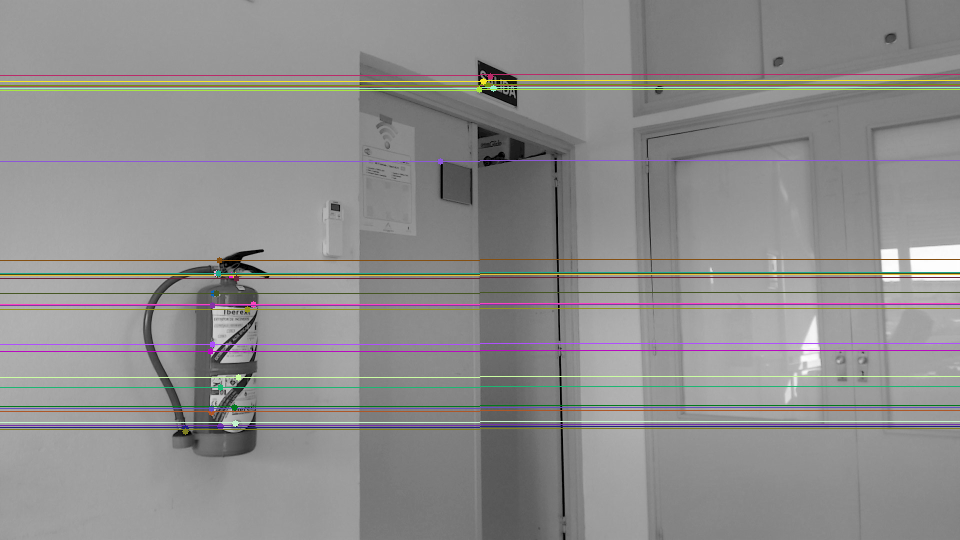

# README: mediapipe-gait-analysis

> README for the cal+mp branch that will probably be added to the main branch if everything works alright
> 

<aside>
❗ This repository is based on this two repositories:

   [https://github.com/TemugeB/python_stereo_camera_calibrate](https://github.com/TemugeB/python_stereo_camera_calibrate)

   [https://github.com/savnani5/Depth-Estimation-using-Stereovision](https://github.com/savnani5/Depth-Estimation-using-Stereovision)

</aside>

**Contents**:

- “calibration_settings.yaml” - YAML file with data needed for the calibration process using a checkerboard
- “calib_tools.py” - contains all the functions needed for the pre-processing of the videos: getting all matrices that define the geometry of the two-view system
- “calib_main.py” - calls out the functions needed from “calib_tools.py” to get the intrinsic and extrinsic parameters of two cameras, together with their rectification homography matrices and their fundamental and essential matrices, defining the epipolar geometry of the system
- “mp_settings.yaml” - YAML file that defines the world coordinate origin for the system
- “mp_tools.py” - contains all the functions needed to read the parameters obtained in the pre-processing step and the necessary functions to run MediaPipe and perform the calculations needed for triangulation
- “mp_main.py” - calls out the functions needed from “mp_main.py”

**Packages required:**

```
OpenCV
Numpy
YAML
MediaPipe
```

## Procedure

### STEP 0 - Edit calibration_settings.yaml file

First of all, edit the “calibration_settings.yaml” file according to your setup configuration. This is a preview of the content of the file and a brief explanation of each term:

```yaml
---
 camera0: 0
 camera1: 2
 frame_width: 1280
 frame_height: 720
 view_resize: 2
 mono_cal_frames: 15
 square_size: 3 # square board size in cm
 board_rows: 6
 board_cols: 7
```

- camera0 and camera1 - device ids
- frame_width and frame_height - frame size
- view_resize - frame resize factor for viewing purposes
- mono_cal_frames - number of pictures that will be taken to perform the calibrations for both cameras individually
- square_size - size of the checkerboard squares in cm
- board_rows and board_cols - number of crosses in the checkerboard (i.e. for a 8x8 checkerboard we would write 7 rows and 7 columns)

Once the file is edited, run the code “calibration_main.py“. It is divided in different steps that will be explained below.

### STEP 0 - Load calibration settings

The calibration_settings.yaml” that was previously edited will be loaded using the *load_calibration_settings* function. 

### STEP 1 - Take images from each individual camera

Using the function *take_mono_frames* for both camera0 and camera1, a video captured by each camera at a time will be displayed. 

When the user presses the “s” key, the program will save that frame. The window will close when the number previously stated in the settings YAML file is specified. Make sure to correctly place the checkerboard in different positions, so that the pattern is well seen by the camera.

The images will be saved in a folder named “single_frames” and each picture will be named “camera id_frame number.png” (e.g. camera0_1.jpg)

### STEP 2 - Get and save intrinsic parameters for individual cameras

The **intrinsic parameters** of any camera are related to its internal optical and geometric characteristics (image optical center, focal length, lens distortion, skew coefficient, etc.)

The camera intrinsic matrix K is composed of the focal lengths ($f_x$,  $f_y$) in pixel units, and the image optical center ($c_x$, $c_y$), which is usually close to the center of the image.

$$
K = 
\begin{bmatrix}
f_x & 0   & c_x \\
0   & f_y & c_y \\
0   & 0   & 1 
\end{bmatrix}
$$

In this step, the OpenCV function *drawChessboardCorners* is a corner detection algorithm that will identify the checkerboard pattern. For each image taken, the program will display it with the estimations performed. The user should press “s” to skip the image if the pattern is not well defined or press any other key to take into account the measurement of the image displayed. 


Once the user has gone through all the images stored where the checkerboard pattern was identified, the *calibrateCamera* OpenCV function will return the intrinsic matrix K of the camera.

In our case, the distortion coefficients are set to be 0, but this will depend on the camera model used. 

The function *save_intrinsic* will save these parameters in a newly created folder “camera_parameters” under the names “camera id_intrinsics.dat” (e.g. camera0_intrinsics.dat)

The RMSE value will be displayed, a good calibration would correspond to a value of less than 0.3

```
K:
897.177 0.0 675.697 
0.0 884.621 347.097 
0.0 0.0 1.0 
dist:
0.0 0.0 0.0 0.0 0.0
```

### STEP 3 - Take an image from both cameras at the same time

Show the checkerboard to both cameras and press the “s” key. The procedure is the same as the one before for individual cameras, but this tame both cameras will capture an image at the same time. 

The resulting images will be saved on a new folder named “stereo_frames” under the names “camera0_1.png” and “camera1_1.png”



Image 1 - camera0_1.png



Image 2 - camera1_1.png

### STEP 4 - Calculate $F$, $E$, $R$, and $t$ matrices

First of all, the images previously saved in the folder “stereo_frames” will be read. The images are resized for them to be the same size and scaled down by a factor of 0.5 so that the computation doesn’t take too long.

The program will now call out different functions from the *calib_tools.py* file to calculate and store the matrices and some pictures.

(i) *draw_keypoints_and_match*

This function first uses an ORB detector to find keypoints in the images and a Brute Force based matcher to find their best matches. Then draws the keypoints and saves the image with matching keypoints in a newly created folder “images”. The output of this function is a list of corresponding keypoints for the input images



Images with matching keypoints

(ii) *RANSAC_F_matrix*

The function calculates the fundamental matrix with the matching points previously obtained as an input using the 8-point algorithm with SVD and the RANSAC algorithm to reduce outliers

(iii) *calculate_E_matrix*

This function calculates the essential matrix from the fundamental matrix obtained in the previous step and the camera intrinsic matrices

(iv) *extract_cameraposes* and *get_camerapose*

These functions calculate the extrinsic parameters (rotation and translation matrices) from the essential matrix

### STEP 5: RECTIFICATION

The process of rectification is one of the most important parts in stereovision, as it reduces the problem to 2D. It consists of making the epipolar lines horizontal, reprojecting the iamge planes onto a common plane parallel to the line between the camera centers. So an introduction to epipolar geometry will be briefly explained.

********************************EPIPOLAR GEOMETRY********************************

The epipolar geometry is the intrinsic projective geometry between two views. It only depends on the cameras’ internal parameters and relative pose. It satisfies the following relation:

$$
x'Fx = 0
$$


The function rectification gives as a result the list of rectified matching points and the two images rectified.



Rectified Image 1



Rectified Image 2

Finally, the extrinsic parameters and the homography matrices for the rectification are saved on the “camera_parameters” folder. Camera0 is set to be the world coordinate origin, thus its rotation matrix will be an 3x3 identity matrix, and its translation vector will be a 3x1 zero-vector.

```
R:
1.0000000000000002 8.191202972208433e-14 -2.088677842656944e-13 
-8.19149813628714e-14 1.0000000000000002 9.10382880192579e-15 
2.092620580142487e-13 -9.270362255620229e-15 1.0000000000000004 
t:
-1.0000000000000002 
8.271064153486403e-14 
-2.1522981652086614e-13
```

```
H1:
0.717723168398025 0.0002515705193740578 -13.734450609266903 
6.372210307361034e-14 0.7071067811866124 -2.1335581119162527e-11 
2.352962348137599e-16 2.39999701920599e-16 0.7071067811865479 
H2:
1.0 -6.277476838849451e-14 1.693933882052079e-11 
6.277476838849451e-14 1.0 -3.012701199622825e-11 
0.0 0.0 1.0
```

### STEP 6: COMPUTE EPILINES AND SAVE IMAGES



Rectified Image 1 with epilines



Rectified Image 2 with epilines

### STEP 7: DISPARITY MAP AND DEPTH COMPUTATION


